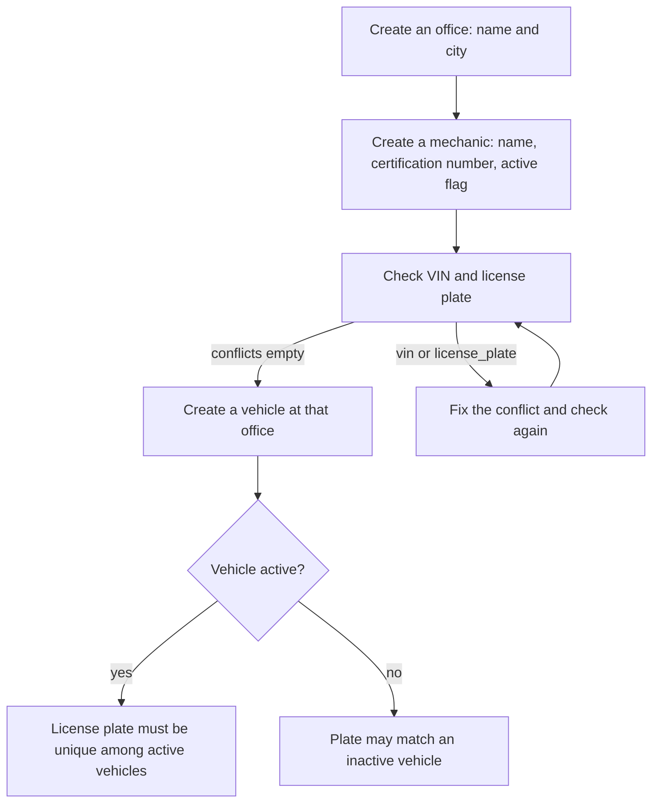
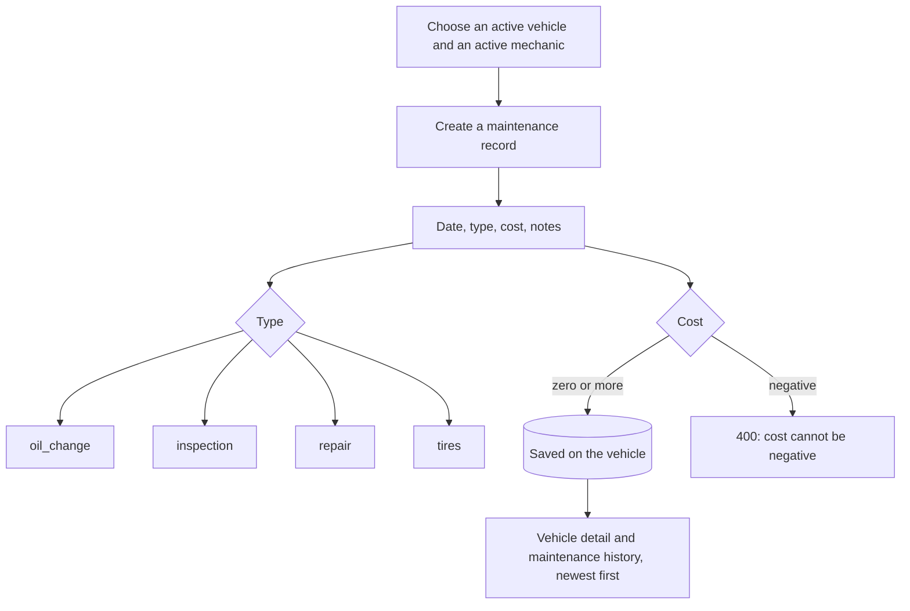
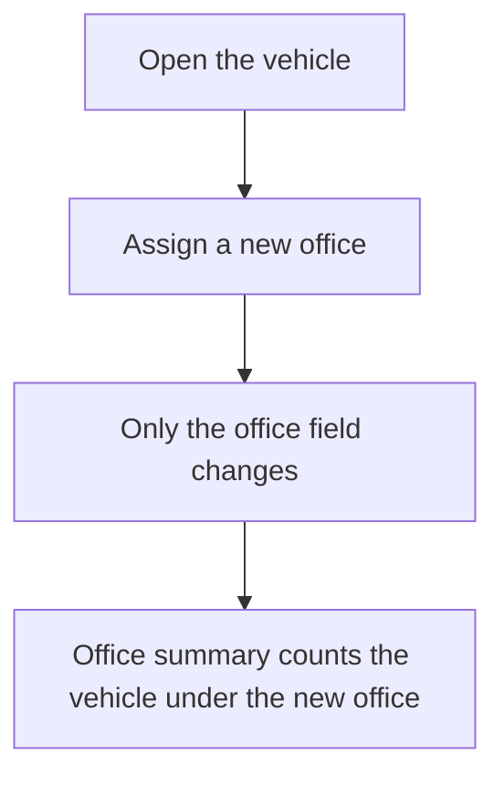
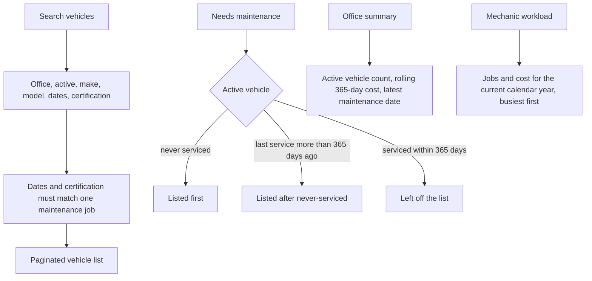

# Flows

The Next.js app on port 3000 calls the Django API on port 8000. The access token stays in memory. The refresh token stays in the `fleet_refresh` cookie.

## Sign in

```mermaid
flowchart TD
  open[Open the app] --> restore[Call refresh with the fleet_refresh cookie]
  restore -->|cookie valid| home[Vehicle search]
  restore -->|no cookie or expired| login[Sign in as fleet]
  login --> token[API returns an access token and sets the refresh cookie]
  token --> home
  home --> call[Any API call sends the bearer access token]
  call -->|token valid| ok[Request proceeds]
  call -->|401| refresh[Refresh once using the cookie]
  refresh -->|new access token| call
  refresh -->|cookie invalid| login
  home --> logout[Sign out]
  logout --> clear[Blacklist the refresh token and clear the cookie]
  clear --> login
```

Sign-in is the only step that sends the password. `/admin/` uses a separate staff account from `createsuperuser`.

## Set up the fleet

Offices, mechanics, and maintenance records are created through the API or Django admin. The UI creates and edits vehicles.



A VIN is unique for every vehicle, active or not.

## Record maintenance



Deleting an office, vehicle, or mechanic that still has records is rejected. Remove or reassign those rows first.

## Move a vehicle



Assign does not write a history of past offices and does not change maintenance records.

## Find work



Make and model match any case-insensitive fragment, so `toy` finds `Toyota`.

## Admin

A staff user signs in at `/admin/`. The home page charts active vehicles by office, maintenance cost over the same rolling year as the office summary, and the ten busiest mechanics this year. Offices, vehicles, mechanics, and maintenance records can be edited there.
