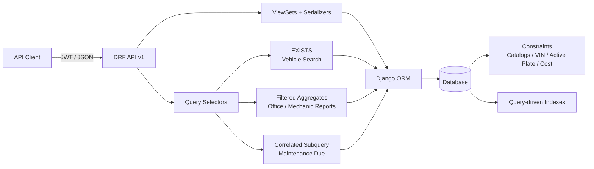

# System Design Notes

This document highlights the main backend design decisions behind the Fleet Maintenance API. It is intentionally short and focuses on the choices that most affect correctness, query behavior, and maintainability.

## Design goals

I optimized the solution around three principles:

1. **Protect important invariants at the database boundary**, not only at the API layer.
2. **Treat query behavior as part of correctness**, especially where the requirements mention hundreds of maintenance records.
3. **Add architectural structure only where the problem demonstrates a need for it**, rather than introducing service or repository layers by default.

The result is a conventional Django/DRF application with explicit database constraints, query-focused selectors, bounded query counts for the advanced endpoints, and tests that verify those properties.

## Architecture



CRUD remains in DRF viewsets. Query logic moves to [`fleet/selectors.py`](../backend/fleet/selectors.py) only when an endpoint contains meaningful query or domain semantics.

## 1. Database invariants, not only API validation

The API validates input to provide useful client errors, but invariants that must always hold are also enforced by the database.

Examples in [`fleet/models.py`](../backend/fleet/models.py):

- `VehicleMake` is canonical reference data, with a globally unique `name`.
- `VehicleModel` belongs to one `VehicleMake`, and the `(make, name)` pair is unique. The same
  model name can therefore exist under different makes.
- `Vehicle` stores only its `model_id`; its make is always derived through `model.make`. This
  removes the possibility of storing an inconsistent make/model pair on a vehicle.
- `Vehicle.vin` is globally unique.
- Active vehicles cannot share a license plate. This is implemented with a conditional `UniqueConstraint(..., condition=Q(active=True))`, so an inactive vehicle does not permanently reserve a plate.
- `Mechanic.certification_number` is globally unique.
- `MaintenanceRecord.cost` has both a `MinValueValidator` and a database `CheckConstraint(cost__gte=0)`.
- Office, vehicle-make, vehicle-model, mechanic, and maintenance-type relationships use `PROTECT` where deleting the parent would invalidate existing records.
- Vehicle deletion uses `CASCADE` for maintenance history; operational retirement is represented by `active=false`.

The active-plate rule is a useful example of the boundary between application and database concerns: serializer validation provides a clear HTTP 400, while the database remains the final authority on integrity.

## 2. Query shape is part of correctness

Several requirements are easy to implement functionally but easy to implement poorly at the SQL level. I treated query count and query semantics as part of the endpoint contract.

| Problem | Decision | Result |
|---|---|---|
| Vehicle detail with hundreds of records | `select_related("office", "model__make")` + targeted `Prefetch` | 300 maintenance records in exactly 2 queries |
| Vehicle and maintenance-record reads | Join normalized catalog paths up front | No per-row make/model queries |
| Combined maintenance filters | One correlated `EXISTS` subquery | Same-record semantics, no duplicate vehicle rows |
| Office summary | Filtered aggregates + `Count(distinct=True)` | 1 query |
| Mechanic workload | Filtered aggregates | 1 query |
| Maintenance due | Correlated latest-date `Subquery` | 2-query paginated result |

The implementation is in [`fleet/selectors.py`](../backend/fleet/selectors.py), with the HTTP boundary in [`fleet/views.py`](../backend/fleet/views.py).

Vehicle querysets use `select_related("office", "model__make")`, including the
maintenance-due selector. Maintenance-record reads follow the normalized relationship with
`select_related("vehicle__model__make", "mechanic", "type")`. Vehicle detail keeps its bounded
two-query guarantee: one query loads the vehicle with its office, model, and make, and one
prefetch query loads the complete maintenance history with each record's mechanic and type.

### Why `EXISTS` for vehicle search

Vehicle make and model filters accept catalog IDs, not textual names. When both are supplied,
the selected model must belong to the selected make; an incompatible pair returns HTTP 400.

The vehicle search can also combine a maintenance date range with a mechanic certification
number. Those predicates must match the **same maintenance record**.

A normal join can duplicate vehicle rows and usually pushes the implementation toward `DISTINCT`. Separate joins can be worse: one maintenance row could satisfy the date filter while another satisfies the mechanic filter.

The selector instead builds one correlated maintenance-record query and applies it with `Exists(...)`. This keeps the outer vehicle query unique and preserves the intended same-record semantics.

### Why a correlated subquery for maintenance due

"Needs maintenance" depends on the latest qualifying maintenance date for each vehicle. The implementation selects that value with a correlated `Subquery`, ignoring records dated after today.

This keeps the rule in SQL, avoids Python-side grouping, and allows never-maintained vehicles and stale vehicles to be ordered in one queryset.

## 3. Architecture follows demonstrated complexity

I deliberately avoided introducing repository classes, generic service layers, or base selector abstractions.

Simple CRUD stays where DRF already handles it well. Query-heavy behavior lives in small plain functions because those functions own real semantics: date windows, aggregate rules, same-record search behavior, and maintenance-due logic.

This keeps the codebase easy to navigate while still separating HTTP concerns from non-trivial query rules.

The main flow is:

```text
request
  -> DRF validation
  -> viewset/action
  -> query-specific selector when needed
  -> ORM
  -> serializer
```

## 4. API boundary and discoverability

All application endpoints are versioned under `/api/v1/`.

The project uses DRF serializers for request validation and `drf-spectacular` for the OpenAPI contract. Swagger exposes the API for manual inspection, and JWT authentication is enabled as an optional challenge bonus.

The API intentionally keeps read and write relationships asymmetric where it improves usability:
related objects are nested on reads, while writes use IDs. In particular, vehicle writes accept
`model_id` and derive the make; they do not accept make or model names, or `make_id`. VehicleModel
writes accept `make_id`. Other relationships use `office_id`, `vehicle_id`, `mechanic_id`, and
`type_id`.

See [`fleet/views.py`](../backend/fleet/views.py), [`fleet/serializers.py`](../backend/fleet/serializers.py), and the generated API documentation described in the [README](../README.md).

## 5. Tests as executable architectural constraints

The test suite does more than verify response payloads.

It explicitly checks:

- normalized make/model catalog constraints and the rule that a vehicle derives its make from
  its model;
- database constraints through direct ORM writes, including unique mechanic certification
  numbers;
- API validation independently from database integrity, including ID-based catalog filters and
  incompatible make/model pairs;
- query ceilings using `assertNumQueries` for vehicle lists and writes, vehicle-model lists,
  maintenance-record lists, filtered search, and advanced endpoints;
- the 300-record vehicle-detail case;
- search semantics and date boundaries;
- OpenAPI paths, responses, and security declarations;
- migration drift and schema validation.

Examples are in:

- [`test_models.py`](../backend/fleet/tests/test_models.py)
- [`test_crud_api.py`](../backend/fleet/tests/test_crud_api.py)
- [`test_selectors.py`](../backend/fleet/tests/test_selectors.py)
- [`test_advanced_api.py`](../backend/fleet/tests/test_advanced_api.py)

This turns performance-sensitive decisions into regression checks instead of leaving them as comments or assumptions.

## 6. CI and quality gates

GitHub Actions runs separate backend and frontend jobs on pull requests to `main` and pushes to
`main`. The backend job installs the Python dependencies, runs Django system checks, verifies
that migrations are current, executes the test suite, and validates the OpenAPI schema. The
frontend job installs locked npm dependencies, then runs linting, TypeScript checks, tests, and
the production build.

## 7. Intentional tradeoffs and production boundaries

This is a take-home implementation, not a claim of production readiness.

Important boundaries are explicit:

- SQLite is kept for simplicity; PostgreSQL would be the natural production database.
- Development settings still include concerns such as hard-coded secrets, permissive CORS, and `DEBUG=True`.
- Vehicle detail has a bounded **query count**, but intentionally returns the complete history, so response size is not bounded.
- Office assignment history is not modeled; historical maintenance is therefore attributed to the vehicle's current office.
- The database protects concurrent uniqueness races, but the narrow race between serializer validation and insert is not translated into a custom HTTP 400 handler.

These were kept visible rather than hidden behind additional infrastructure that the challenge did not require.

## Summary

The main design choice was to keep the application structurally simple while being strict about the areas that matter most for a backend system: **data integrity, query semantics, predictable database access, and executable regression checks**.

The implementation details are intentionally close to standard Django and DRF so that the important decisions remain visible in the code rather than being obscured by framework layers.
